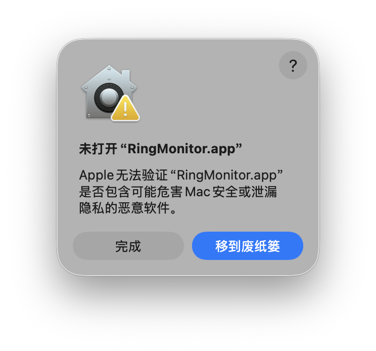
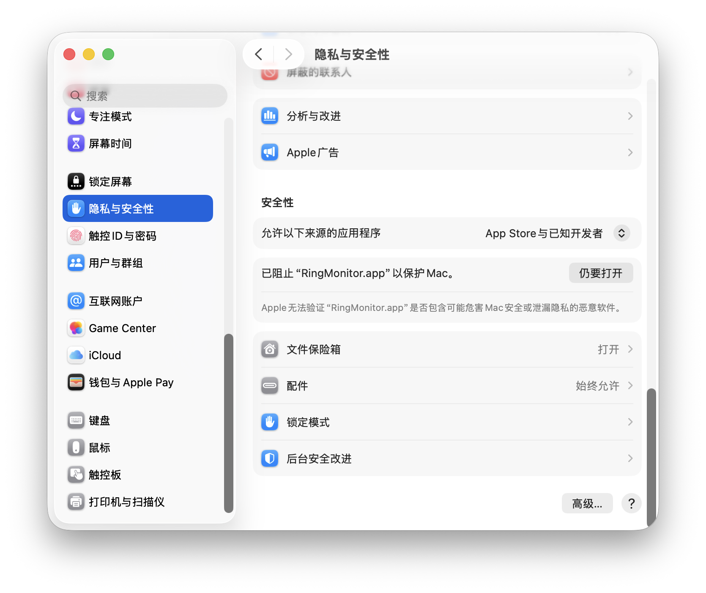
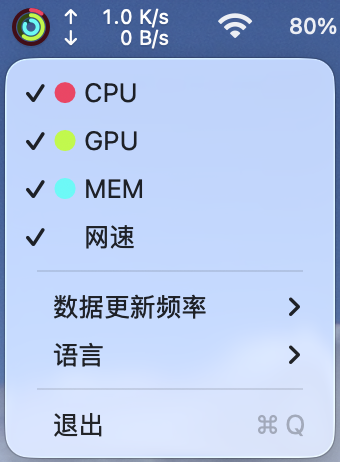
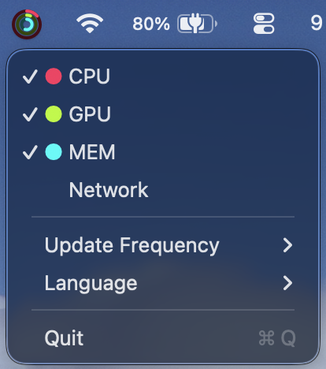

<p align="center">
  
</p>

<h1 align="center">RingMonitor</h1>

一个 Apple Activity 风格的资源使用率菜单栏监控。

[下载最新版本（Apple Silicon）](https://github.com/RYDE-PLAY/RingMonitor/releases/latest)

## 无法打开应用

如果 macOS 首次打开时提示无法验证“RingMonitor.app”，请先点击“完成”，然后前往“系统设置 > 隐私与安全性”，在安全性区域点击“仍要打开”，再确认一次即可。

<table align="left">
  <tr valign="top">
    <td>
      <p align="center">
        
      </p>
    </td>
    <td>
      <p align="center">
        
      </p>
    </td>
  </tr>
</table>

<br clear="all">

## 预览

<table align="left">
  <tr valign="top">
    <td>
      <p align="center">
        <br>
        浅色模式菜单
      </p>
    </td>
    <td>
      <p align="center">
        <br>
        深色模式菜单
      </p>
    </td>
  </tr>
</table>

<br clear="all">

## 手动构建

```sh
./build_app.sh
open ./RingMonitor.app
```
